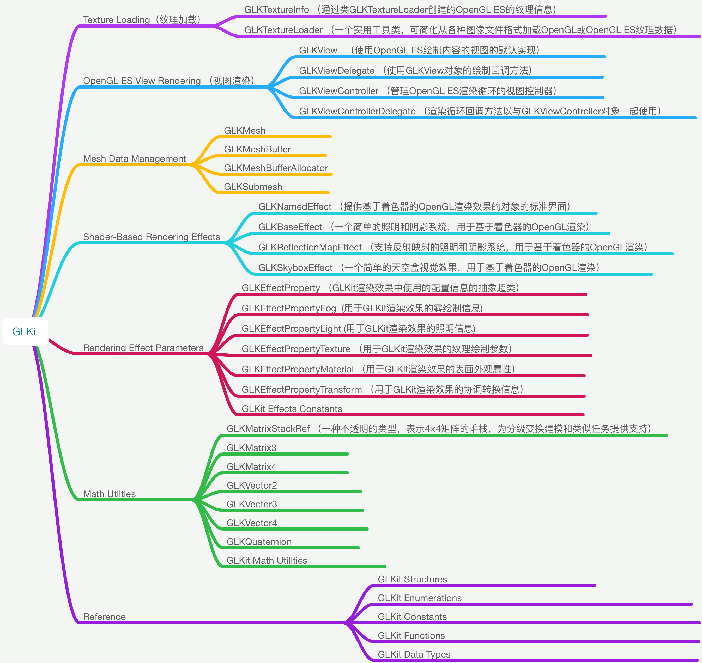

# OpenGL ES - - GLKit（GLKBaseEffect）
> Speed up OpenGL ES or OpenGL app development. Use math libraries, background texture loading, pre-created shader effects, and a standard view and view controller to implement your rendering loop.
> 加快OpenGL ES或OpenGL应用程序开发。 使用数学库，背景纹理加载，预先创建的着色器效果以及标准视图和视图控制器来实现渲染循环。





### 以一个简单的案例来使用 GLKBaseEffect 

> GLKBaseEffect is designed to simplify visual effects common to many OpenGL applications today. 
>  GLKBaseEffect旨在简化当今许多OpenGL应用程序常见的视觉效果。
> 
> GLKBaseEffect is program based and, with the binding of its underlying GLSL program
> GLKBaseEffect是基于程序的，并且通过其基础GLSL程序的绑定
> 
> GLKBaseEffect requires at least an OpenGL Core Profile.  An appropriate context must be created and made current prior to instantiating and initializing GLKBaseEffect objects.

#### 使用GLKBaseEffect的规范步骤是

- (1) 分配并初始化GLKBaseEffect的一个实例

    ```
    directionalLightEffect = [[GLKBaseEffect alloc] init];
    ```
- (2) 在效果上设置所需的属性

    ```
     // Configure light0
      directionalLightEffect.light0.position = lightPosition;
      directionalLightEffect.light0.diffuseColor = diffuseColor;
      directionalLightEffect.light0.ambientColor = ambientColor;

      // Configure material
      directionalLightEffect.material.diffuseColor = materialDiffuseColor;
      directionalLightEffect.material.ambientColor = materialAmbientColor;
      directionalLightEffect.material.specularColor = materialSpecularColor;
      directionalLightEffect.material.shininess = 10.0;
    ```
- (3) 优选用顶点数组对象初始化顶点属性/顶点数组状态为要绘制的模型或场景

    ```
        glGenVertexArraysOES(1, &vaoName);
        glBindVertexArrayOES(vaoName);

      // 为每个顶点属性创建并初始化VBO
      // 下面的例子展示了一个设置位置顶点属性的例子.
      // 为每个额外的所需属性重复以下步骤：normal，color，texCoord0，texCoord1.
      
      glGenBuffers(1, &positionVBO);
      glBindBuffer(GL_ARRAY_BUFFER, positionVBO);
      glBufferData(GL_ARRAY_BUFFER, vboSize, dataBufPtr, GL_STATIC_DRAW);
      glVertexAttribPointer(GLKVertexAttribPosition, size, type, normalize, stride, NULL);
      glEnableVertexAttribArray(GLKVertexAttribPosition);

      ...针对其他所需的顶点属性重复上述步骤

      glBindVertexArrayOES(0);   // unbind the VAO we created above
    ```
- (4) 对于每个绘制的帧：更新每帧更改的属性。 通过调用 - [GLKBaseEffect prepareToDraw] 同步更改的效果状态。用效果画出模型.  用效果画出模型

    ```
        directionalLightEffect.transform.modelviewMatrix = modelviewMatrix;
        [directionalLightEffect prepareToDraw];
        glBindVertexArrayOES(vaoName);
        glDrawArrays(GL_TRIANGLE_STRIP, 0, vertCt);
    ```


详细代码：[DEMO](https://github.com/Caolongs/OpenGL-ES---GLKit)


