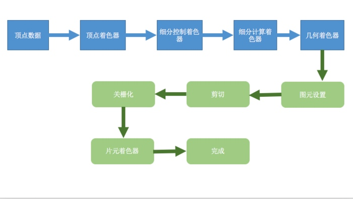

# OpenGL 
2D + 透视 = 3D
模型渲染成可视化图像的过程

模型（场景对象）：通过几何图元（点、线、三角形）来构建的。

什么叫光栅化？
将输入图元的数学描述转为屏幕位置对应的像素片元，称为光栅化

### OpenGL 程序

渲染:表示计算机从模型创建最终图像的过程。OpenGL 只是一种基于光栅化的系统。
模型（场景对象）：通过几何图元（点、线、三角形）来构建的。
着色器，它是图形硬件设计所执行的一类特殊的函数。可以理解为图像处理单元（GPU）编译的一种小型程序。
四种不同的着色阶段（shander stage），其中最常用的包括顶点着色器（vertex shader）以及片元着色器，前者用于处理顶点数据，后者用于处理光栅化后的片元数据。所有OpenGL程序都需要用到这两类着色器
帧缓存（framebuffer），像素（pixel），是显示器上最小的可见单元。计算机系统将所有的像素保存到帧缓存当中，后者是有图形硬件设备管理的一块独立内存区域，可以直接映射到最终的显示设备上

###  OpenGL 渲染图像的OpenGL 程序需要执行的操作：

* 从OpenGL的几何图元中设置数据，用于构建形状。
* 使用不同的着色器（shader）对输入的图元数据执行计算操作，判断它们的位置、颜色，以及其他渲染属性。
* 将输入图元的数学描述转化为与屏幕位置对应的像素片元（fragment）。这一步也称为光栅化（rasterization）。
* 最后，针对光栅化过程产生的每个片元，执行片元着色器（fragment shader），从而决定这个片元的最终颜色和位置。
* 如果有必要，还需要对每个片元执行一些额外的操作，例如判断片元对应的对象是否可见，或者将片元的颜色与当前屏幕位置的颜色进行融合。

### OpenGL 常见流程

* 顶点着色器 和 片元着色器是必需的。细分和几何着色器是可选的捕捉。
* OpenGL 需要将所有的数据都保存到缓存对象中（buffer object）

要将所有的
要将所有的

有3中向OpenGL着色器传递渲染数据的方法
* 属性
* uniform 值
* 纹理

