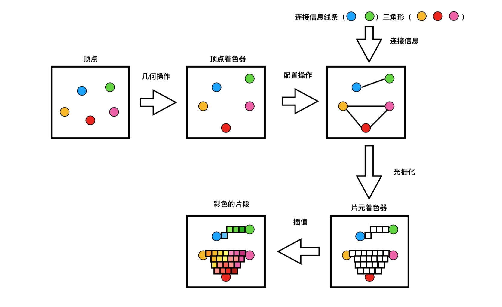

# OpenGL 与 OpenGL ES 

## 一、什么是图形编程接⼝

**2D图形编程接⼝**: GDI, Skiz, OpenVG 
**3D图形编程接口**: DirectX, OpenGL/OpenGL ES, Embedded Systems

## 二、图形编程接口与图形硬件的关系

OpenGL，图形编程的接口
GPU 图形硬件，图形处理器

简单理解为：
> 当应用需要图形的绘制以及渲染时，它会通过OpenGL ES框架，向GPU传输相应绘制指令，GPU收到指令后会进行相应操作），最终将渲染结果在屏幕上绘制出来。

## 三、OpenGL 的特点

1.跨操作系统平台运⾏
2.隐藏底层硬件信息 
3.专⽤渲染接⼝

## 四、OpenGL ES 

OpenGL for Embedded Systems（OpenGL ES）是OpenGL的简化版本（专门为嵌入式系统设计，在移动端操作系统中应用广泛），该版本消除了冗余功能，提供了更易学习且易于在移动图形硬件中实现的库。

## 五、OpenGL ES 的版本

* OpenGL ES 1.X :针对固定功能流⽔水管线硬件 
* OpenGL ES 2.X :针对可编程流⽔水管线硬件 
* OpenGL ES 3.X :OpenGL ES 2.0的扩展

## 六、着色器渲染过程

在渲染过程中，必须存储2种着色器，分别是顶点着色器、片元着色器。顶点着色器是第一个着⾊器、片元着色器是最后一个。顶点着⾊器中处理顶点、片元着⾊器处理理像素点颜⾊。

