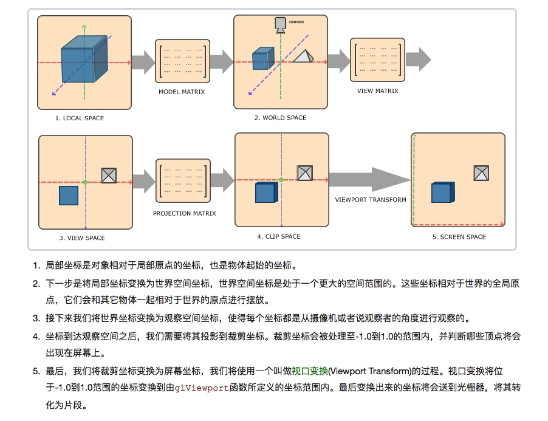

# OpenGL 常见概念性理解整理

### 什么叫光栅化（Rasterize/rasteriztion）？
栅格化或者像素化，就是把矢量图形转化成像素点儿的过程

我们屏幕上显示的画面都是由像素组成，而三维物体都是点线面构成的。要让点线面，变成能在屏幕上显示的像素，就需要Rasterize这个过程。就是从矢量的点线面的描述，变成像素的描述

### 图元是什么？
 图元可以理解为组成图形的基本单元
 比如点、线、三角形。 我们可以通过一系列函数或顶点数据帮助我们实现多种多样的图形。

### 什么叫管线？
管线(pipeline),可以理解为渲染流水线。**管线，实际上指的是一堆原始图形数据途经一个输送管道，期间经过各种变化处理最终出现在屏幕的过程**。
图形渲染管线可以被划分为两个主要部分：第一部分把你的3D坐标转换为2D坐标，第二部分是把2D坐标转变为实际的有颜色的像素。

### 什么叫固定管线？
可以简单理解为渲染图像的这个过程，我们只能通过调用GLShaderManager类的固定管线效果实现我们一系列的着色器处理。

### 什么可编程管线？
可以简单理解， 在我们处理图形的过程，我们必须使用顶点着色器和片元着色过程。我们可以才有GLSL自行编写着色器程序，来执行这个过程的事情。

### 顶点着色器调⽤次数与⽚元着⾊器调⽤次数与什么有关?谁⽐较多?

片元着⾊色器次数比较多!
顶点着色器调⽤次数与顶点数量相关，
⽚元着色器调用与像素多少相关

### 为什么需要对三维空间的顶点进行坐标空间转换?

输⼊到计算机当中一系列三维坐标的点,但是我们看到的屏
幕是二维坐标点.所以需要转换
ObjectSpace(物体空间/模型空间)-> WorldSpace(世界空
间)->EyeSpace(观察空间)->ClicpAndProjectSpace(屏幕
空间)

### 在OpenGL 中有5种坐标系。
1.局部坐标系(物体空间)
2.世界空间
3.观察空间(视觉空间)
4.裁剪空间
5.屏幕空间

这是一个顶点最终转化到片段之前需要经历的所有不同的状态变化。

那这些变换通过什么？
比如模型、观察、投影三个矩阵的。

### 背面剔除和深度测试使用场景

背面剔除是为了解决自身图片背部可见问题
深度测试是为了解决图形重叠的问题

### Shader
**Shader**，中⽂名，着色器。着⾊器其实就是一段在GPU运行的程序（图形硬件设计所执行的一类特殊的函数，可以理解为图像处理单元（GPU）编译的一种小型程序）。
我们平时的程序，是在CPU运行。由于GPU的硬件设计结构与CPU有着很大的不同，所以GPU需要一些新的编程语言

### 术语理解
**渲染**:表示计算机从模型创建最终图像的过程。OpenGL 只是一种基于光栅化的系统。
**模型（场景对象）**：通过几何图元（点、线、三角形）来构建的。
**着色器**，它是图形硬件设计所执行的一类特殊的函数。可以理解为图像处理单元（GPU）编译的一种小型程序。
**四种不同的着色阶段（shander stage）**，其中最常用的包括顶点着色器（vertex shader）以及片元着色器，前者用于处理顶点数据，后者用于处理光栅化后的片元数据。所有OpenGL程序都需要用到这两类着色器
**帧缓存（framebuffer）**，像素（pixel），是显示器上最小的可见单元。计算机系统将所有的像素保存到帧缓存当中，后者是有图形硬件设备管理的一块独立内存区域，可以直接映射到最终的显示设备上

###  OpenGL 渲染图像的OpenGL 程序需要执行的操作：

* 从OpenGL的几何图元中设置数据，用于构建形状。
* 使用不同的着色器（shader）对输入的图元数据执行计算操作，判断它们的位置、颜色，以及其他渲染属性。
* 将输入图元的数学描述转化为与屏幕位置对应的像素片元（fragment）。这一步也称为光栅化（rasterization）。
* 最后，针对光栅化过程产生的每个片元，执行片元着色器（fragment shader），从而决定这个片元的最终颜色和位置。
* 如果有必要，还需要对每个片元执行一些额外的操作，例如判断片元对应的对象是否可见，或者将片元的颜色与当前屏幕位置的颜色进行融合。

### OpenGL 常见流程

* 顶点着色器 和 片元着色器是必需的。细分和几何着色器是可选的捕捉。
* OpenGL 需要将所有的数据都保存到缓存对象中（buffer object）

### 屏幕渲染⽅式

#### On-Screen Rendering(当前屏幕渲染)
指的是GPU的渲染操作是在当前用于显示的屏幕缓存区中进行的。

#### Off-Screen Rendering(离幕渲染)
指的是GPU在当前屏幕缓存区以外新开辟一个缓存区进行渲染操作

一般情况下，OpenGL ES 会将应用提供到渲染服务的动画直接渲染显示(使用基本的渲染的流程) 但对于一些复杂的图像动画的渲染，并不能够直接渲染叠加显示出来。而是需要根据 `Command Buffer` 分通道进⾏行渲染再组合。这个组合过程中，就有些渲染通道是不会直接显示出来的。标记此次渲染需要更多的渲染通道和合并步骤，⽽这些没有直接渲染显示在屏幕上的通道就是离屏渲染通道。

#### 离屏渲染为什么会卡顿?
离屏渲染需要更多的渲染通道，而不同的渲染通道间切换需要消耗⼀定的时间，这个时间内GPU会闲置。当通道数量足够时，对性能也会较大的影响。

### 离屏渲染的体现
#### 1、相⽐于当前屏幕渲染，离屏渲染的代价相对⽽言较高。主要有以下2个原因:

1.创建新的缓存区
2.上下文切换

#### 2、那些情况会使⽤离屏渲染(off-Screen Render)?

1. drawRect
2. layer.shouldRasterize = true; 
3. 有mask或者阴影(layer.makesToBounds) shouldRasterize(光栅化)、masks(遮罩)、shadows(阴影) edge antialiasing(抗锯⻮齿)、group opacity(不不透明)
4. Text(UILabel,CATextLayer,CoreText)

## 参照
[OpenGL 绘制基础图形](https://www.jianshu.com/p/fac6c39deec7)

简书 MissCC： [简书 MissCC](https://www.jianshu.com/u/1b4c832fb2ca)

## 目录
[toc]

