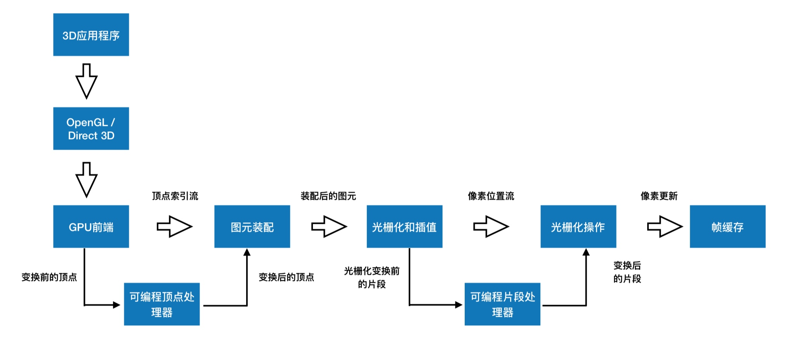

# OpenGL - 渲染过程

## 一、基本图形硬件流水线设计

==应⽤用程序层 -> 硬件抽象层 -> 硬件层==

**应⽤层**: 游戏和应⽤用层软件开发⼈人员为主体，通过调⽤用API进行上层开发，不需要考虑移植性问题。 
**硬件抽象层**: 抽象出硬件的加速功能，进行有利于应用层开发的封装，并向应⽤层开发API 
**硬件层**: 将硬件驱动提供给抽象层，以实现抽象层加速功能的有效性。

## 二、渲染流水线的具体流程

### 1、应⽤层
应⽤程序层主要与内存，CPU打交道，诸如碰撞检测，场景图监理，视锥裁剪等经典算法在此阶段执行。在阶段的末端，几何体的数据(顶点坐标，法向量，纹理坐标，纹理)等通过数据总线传送到图形硬件

### 2、硬件抽象层
在这⼀层，我们目前使用的是DirectX与OpenGL。对于这⼀部分，主要是⼀些API等的调⽤

### 3、硬件层
硬件层在渲染流水线中最为复杂，也最为重要。可编程渲染流水线与固定渲染流水线的区别在于是否对着色器进⾏编程。
  ⾸先我们先了解固定渲染流水线它主要分为以下几个阶段:
  顶点变换 -> 图元转配与光栅化 -> ⽚段纹理映射和着色 -> 光栅化操作

## 三、硬件层—固定渲染管线流程图

**光栅化(Rasterization)**:将顶点数据转换为片元的过程! 将具体的图转化为一个个栅格组成的图像的作⽤
⽚元中每个一个元素对于帧缓存区的一个像素; 光栅化其实是一个将几何图元变成一个二维图像的过程!!
光栅化的过程就是为了产出⽚元

## 四、硬件层—可编程渲染流水线流程图

## 五、GPU 图形渲染管线

**应用程序阶段**
主要是⾼级编程语言开发,C,OC,C++ 
输出:通过数据总线,把几何体的数据(顶点坐标\法线\纹理理坐标\纹理理)等传送到GPU上

**⼏何阶段**
输入:应⽤程序末端的内容 
负责任务:顶点坐标变换,光照,裁剪,投影,屏幕映射 
输出:经过变换和投影之后的屏幕坐标,颜⾊,纹理坐标

**光栅化阶段**
见上

### 光栅化操作

这⼀步我们将会对其进行各种测试，⽽假如它通过了所有的测试，⽚段将会显示在屏幕上

**抖动显示**:一种能够使用较少的颜色种类模拟较多颜色的显示模式

### ⼏何处理阶段
几何阶段主要负责大部分多边形操作和顶点操作，包括顶点着色、坐标变换、生成图元、投影、
 裁剪、屏幕映射等过程，其中顶点着色、坐标变换由顶点着色器完成
1. **顶点着⾊器** 
2. **⽣成图元**： 顶点数组或索引数组经由顶点着色程序生成三角形的组合
3. **投影**： 透视投影，平行投影
4. **裁切**： 仅保留视景体内部的图元进行渲染
5. **屏幕映射**： 这个阶段是不可配置也不可编程的。主要用来实现图元的坐标转换到屏幕坐标
 

## 六、其他

### Shader
**Shader**，中⽂名，着色器。着⾊器其实就是一段在GPU运行的程序。我们平时的程序，是在CPU运行。由于GPU的硬件设计结构与CPU有着很大的不同，所以GPU需要一些新的编程语言

渲染流水线分为两种，其中一种为**可编程渲染流水线**。另外一种为**固定渲染流水线**。(也称可编程管线或固定管线，管线就是流⽔线的意思)。渲染流⽔线可否编程，取决于程序猿能否在顶点着色器以及⽚段着色器上进⾏行编码。⽽现在的渲染流水线，基本都是可编程的，当然，它们也支持固定渲染流水线的功能

### CPU 与 GPU 之间的关系

GPU具有⾼并行的结构，所以在处理图形数据和复杂算法比CPU更加有效率

CPU在执行任务的时候，⼀个时刻只会处理⼀个数据，不存在真正意义上的并行，⽽GPU则有多个处理器核，在⼀个时刻可以并行处理多个数据

### 三维坐标转变为二维屏幕坐标的过程

MC是建模坐标系，WC是世界坐标系，VC是观察坐标系，PC是投影坐标系，NPC是规格化投影坐标系，DC是设备坐标系

### 坐标系详细概念

* **世界坐标系** 坐标系统主要⽤于计算机图形场景中的所有图形对象的空间定位和定义
* **局部坐标系** 独立于世界坐标系来定义物体几何特性
* **观察坐标系** 观察坐标系通常是以视点的位置为原点，通过⽤户指定的一个向上的观察向量来定义整个坐标系统，观察坐标系主要⽤于从观察者的角度对整个世界坐标系内的对象进行重新定位和描述，从而简化⼏何物体在投影面的成像的数学推导和计算
* **投影坐标系** 物体从世界坐标描述转换到观察坐标后，可将三维物体投影到二维表面上，即投影到虚拟摄像机的胶片上，这个过程就是投影变换。以胶片中心为参考原点的空间坐标系称为投影坐标系，物体在投影坐标系中的坐标称为投影坐标。
* **设备坐标系** 是图形设备上采用的与具体设备相关的坐标系。设备坐标系一般采⽤用整数坐标，其坐标范围由具体设备的分辨率决定。设备坐标系上的⼀个点一般对应图形设备上的一个像素。由于具体设备的限制，设备坐标系的坐标范围一般是有限的。
* **规格化设备坐标系** 是为了避免设备相关性而定义的一种虚拟的设备坐标系。规格化坐标系的坐标范围一般从0到1，也有的是从-1到+1。采用规格化设备坐标系的好处是屏蔽了具体设备的分辨率，使得图形处理理能够尽量避开对具体设备坐标的考虑。实际图形处理时，先将世界坐标转换成对应的规格化设备坐标，然后再将规格化设备坐标映射到具体的设备坐标上去。
* **屏幕坐标系统** 也称设备坐标系统，它主要⽤于某⼀特殊的计算机图形显示设备(如光栅显示器)的表⾯的点的定义，在多数情况下，对于每一个具体的显示设备，都有一个单独的坐标系统，在定义了成像窗口的情况下，可进一步在屏幕坐标系统中定义称为视图区(view port)的有界区域，视图区中的成像即为实际所观察到的。

## 参照

简书 MissCC： [简书 MissCC](https://www.jianshu.com/u/1b4c832fb2ca)

[toc]

