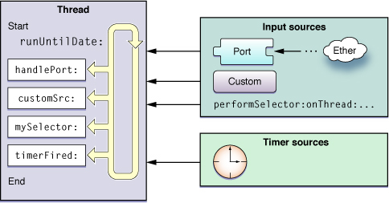

# RunLoop

Runloop 是和线程紧密相关的一个基础组件，是很多线程有关功能的幕后功臣。尽管在平常使用中几乎不太会直接用到，理解 Runloop 有利于我们更加深入地理解 iOS 的多线程模型。

**目的**：保住当前线程的生命,监听事件：触摸、时钟、网络等


##RunLoop基本概念
RunLoop是什么？顾名思义，说白了就是一种循环，只不过它这种循环比较高级。一般的while循环会导致CPU进入忙等待状态，而Runloop则是一种“闲”等待，这部分可以类比Linux下的epoll。当没事件时，Runloop会进入休眠状态，有事件发生时，Runloop会去找对应的Handler处理事件。Runloop可以让线程在需要做事的时候忙起来，不需要的话就让线程休眠。


图中展示了Runloop在线程中的作用：从 input source 和 timer source 接受事件，然后在线程中处理事件。

##Runloop 与线程
Runloop 和线程是绑定在一起的。每个线程（包括主线程）都有一个对应的Runloop对象。我们并不能自己创建Runloop对象，但是可以获取到系统提供的Runloop对象。
主线程的 Runloop 会在应用启动的时候完成启动，其他线程的 Runloop 默认并不会启动，需要我们手动启动。

##Input Source 和 Timer Source
这两个都是 Runloop 时间的来源，其中**Input Source** 又可以分为三类
- Port-Base Source，系统底层的Port时间，例如CFSocketRef，在应用层基本用不到
- Custom Input Source，用户手动创建的Source
- Cocoa Perform Selector Source，Cacoa提供的的performSelector系列方法，也是一种事件源

按照函数调用栈,Source可分为 `Source0` 和 `Source1`。其中 `Source1` 为系统内核事件, `Source0`即非`Source1`

例如：创建事件源

```
    //队列
    dispatch_queue_t queue = dispatch_get_global_queue(0,0);
    //创建一个定时器!!
    self.timer = dispatch_source_create(DISPATCH_SOURCE_TYPE_TIMER, 0, 0, queue);
    //设置定时器
    dispatch_source_set_timer(self.timer, DISPATCH_TIME_NOW, 1000000000, 0);
    dispatch_source_set_event_handler(self.timer, ^{
        NSLog(@"-------%@",[NSThread currentThread]);
    });
    //启动定时器
    dispatch_resume(self.timer);
```

**Timer Source** 顾名思义就是指定时器事件了。例如：`NStimer` 创建定时器


## Runloop Observer
Runloop 通过监控Source来决定有没有任务要做，除此之外，我们还可以用Runloop Observer 可以监控下面的 runloop 事件：
- The entrance to the run loop.
- When the run loop is about to process a timer.
- When the run loop is about to process an input source.
- When the run loop is about to go to sleep.
- When the run loop has woken up, but before it has processed the event that woke it up.
- The exit from the run loop.

通过Runloop Observer 可以实现卡顿优化，如：TableView滑动中加载多张大图
**思路**：每次Runloop循环,只渲染一张大图
**步骤**:
 1.监听Runloop的循环
 2.将加载大图的代码!放在一个数组里面
 3.每次Runloop循环,取出一个加载大图的任务执行
 
 ```
 #pragma mark - <CFRunloop>

- (void)addTasks:(runloopBlock)task{
    [self.tasks addObject:task];
    if (self.tasks.count > 18) {
        [self.tasks removeObjectAtIndex:0];
    }
}

- (void)addRunloopObserver{
    //获取Runloop
     CFRunLoopRef runloop = CFRunLoopGetCurrent();
    //定义一个context
    CFRunLoopObserverContext context = {
        0,
        (__bridge void *)(self),
        &CFRetain,
        &CFRelease,
        NULL
    };
    
    //定义观察者
    static CFRunLoopObserverRef runloopObserver;
    runloopObserver = CFRunLoopObserverCreate(NULL, kCFRunLoopBeforeWaiting, YES, 0, &callBack, &context);
    
    //添加观察者
    CFRunLoopAddObserver(runloop, runloopObserver, kCFRunLoopCommonModes);
    
    //C里面 一旦creat new copy
    CFRelease(runloopObserver);
}

void callBack(CFRunLoopObserverRef observer, CFRunLoopActivity activity, void *info){
    ViewController * vc = (__bridge ViewController *)info;
    if(vc.tasks.count == 0){
        return;
    }
    runloopBlock block = vc.tasks.firstObject;
    block();
    [vc.tasks removeObjectAtIndex:0];
}
 ```
 

## Runloop Mode
在监视与被监视中， Runloop 要处理的事情还挺复杂的。为了让Runloop 能专心处理自己关心的那部分事情，引入了Runloop Mode 概念。


如图所示， Runloop Model 实际上是Source、Timer 和 Observer 的集合，不同的Model 把不同组的 Source、 Timer 和 Observer 隔绝开来。Runloop 在某个时刻只能跑在一个 Mode 下，处理这一个 Model 种种的 Source，Timer 和 Observer。
苹果文档中提到的 Mode 有五个，分别是：
- NSDefaultRunLoopMode
- NSConnectionReplyModel
- NSModalPanelRunLoopMode
- NSEventTrackingRunLoopMode
- NSRunLoopCommonModes

iOS中公开暴露出来的只有 NSDefaultRunLoopMode 和 NSRunLoopCommonMode.NSRunLoopCommonMode实际上是一个Mode的集合，默认包括 NSDefaultRunLoopMode  和 NSEventTrackingRunLoopMode

## 与 RunLoop 相关的坑
日常开发中，与 runloop 接触最近的可能就是NSTimerle。一个 Timer一次只能加入到一个 RunLoop中。我们日常使用的时候，通常就是加入到当前的runLoop的default model中，而ScrollView 在用户滑动的时候，主线程RunLoop会转到NSTrackingRunLoopMode。er这个时候，Timer就不会运行。
有如下两种解决方案：
- 第一种：设置RunLoop Mode，例如NSTimer，我们指定它
  运行于NSRunLoopCommonModes，这是一个Mode的集
  合。注册到这个Mode下后，无论当前runLoop运行哪个
  mode，时间都能得到执行。
- 第二种：另一种解决Timer的方法是，我们在另一个线程执行和处理Timer事件，然后在主线程更新UI。


